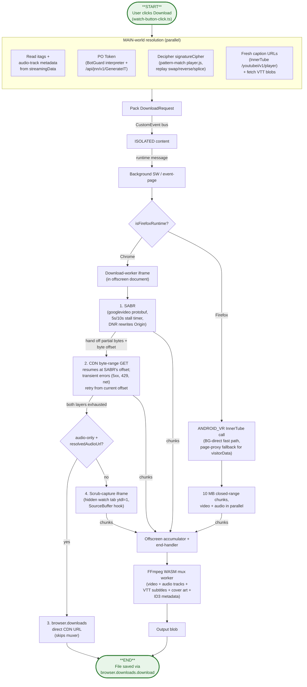
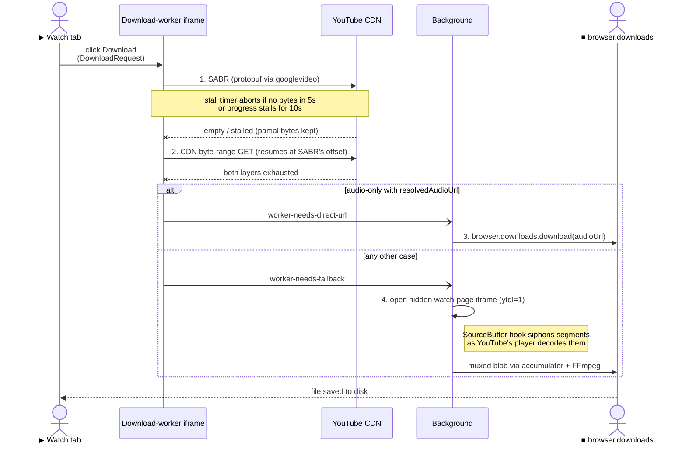
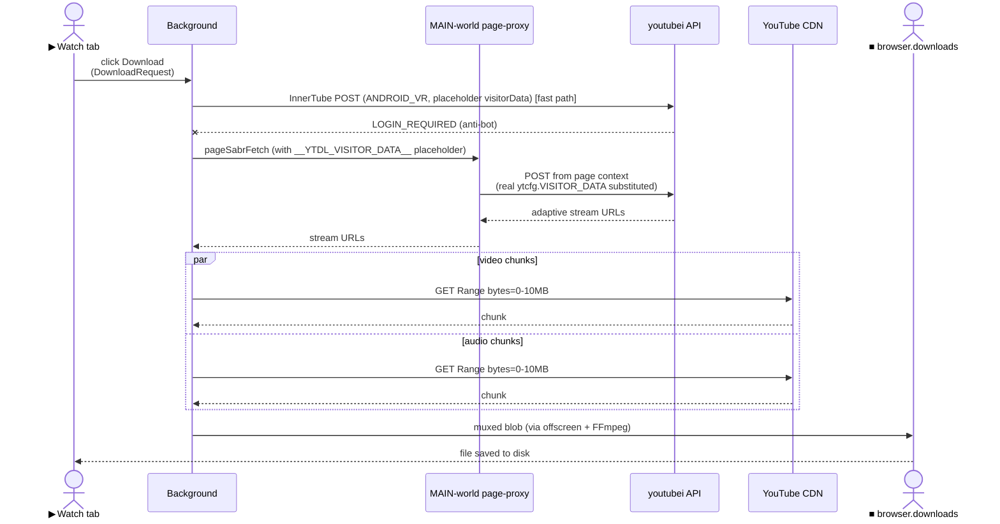

# Architecture

A guide for contributors. The README explains *what* this extension does and how to install it. This document explains *how* it's put together and which constraints shape the design — enough to find your way around the code without reading every file.

The central constraint shaping everything: MV3 fragments execution across isolated runtimes that can't share memory, and the YouTube stream protocol that actually delivers bytes (SABR) is gated by a cryptographic challenge that only the page's own JavaScript can solve. So the architecture is a relay race — page context resolves auth and URLs, the background orchestrates, the offscreen document holds the heavy runtimes (FFmpeg WASM, sandboxed download iframes), and a small handful of typed buses move state between them.

## System diagram

**Where each step lives**

| Diagram node | Code |
| --- | --- |
| User clicks Download | [`watch-button-click.ts:25`](src/entrypoints/youtube-main.content/watch-button/watch-button-click.ts) `buildClickHandler` |
| Read itags + audio-track metadata | [`video-data.ts`](src/entrypoints/youtube-main.content/video/video-data.ts) `buildVideoMetadata` + [`download-formats.ts`](src/entrypoints/youtube-main.content/video/download-formats.ts) |
| PO token (BotGuard + GenerateIT) | [`po-token-generator.ts:32`](src/lib/youtube/po-token-generator.ts) `generatePoToken` (driving [`botguard-vm.ts`](src/lib/youtube/botguard-vm.ts)) |
| Decipher signatureCipher | [`signature-decryptor.ts:61`](src/lib/youtube/signature-decryptor.ts) `decryptSignatureCipher` + [`signature-transforms.ts`](src/lib/youtube/signature-transforms.ts) |
| Fresh caption URLs + VTT fetch | [`caption-urls.ts:47`](src/entrypoints/youtube-main.content/video/caption-urls.ts) `fetchFreshCaptionUrls` + [`caption-fetch.ts`](src/entrypoints/youtube-main.content/video/caption-fetch.ts) |
| Pack DownloadRequest | [`download-request-builder.ts:79`](src/entrypoints/youtube-main.content/video/download-request-builder.ts) `buildEnrichedRequest` |
| Cross-world CustomEvent bus | [`cross-world-messenger.ts`](src/lib/messaging/cross-world-messenger.ts) `crossWorldMessenger` |
| ISOLATED content runtime bridge | [`cross-world-download.ts:8`](src/entrypoints/youtube.content/handlers/cross-world-download.ts) `registerDownloadProgressHandlers` |
| Background SW / event-page entry | [`background/index.ts:21`](src/entrypoints/background/index.ts) `defineBackground` |
| `isFirefoxRuntime?` probe | [`background-downloader.ts:37`](src/entrypoints/background/download/background-downloader.ts) `isFirefoxRuntime` |
| Dispatch to worker iframe vs Firefox path | [`background-downloader.ts:361`](src/entrypoints/background/download/background-downloader.ts) `startBackgroundDownload` |
| Download-worker iframe entry | [`download-worker/main.ts:24`](src/entrypoints/download-worker/main.ts) (message handler) |
| ANDROID_VR InnerTube call | [`android-player.ts:125`](src/lib/youtube/android-player.ts) `resolveAndroidUrls` |
| Firefox page-proxy fallback | [`page-sabr-fetch.content.ts:23`](src/entrypoints/page-sabr-fetch.content.ts) `readVisitorData` + [`:38`](src/entrypoints/page-sabr-fetch.content.ts) `substituteBodyTokens` (bridged via [`page-sabr-fetch-bridge.ts:13`](src/entrypoints/youtube.content/handlers/page-sabr-fetch-bridge.ts) `registerPageSabrFetchBridge`) |
| 1. SABR fetch loop | [`sabr-downloader.ts:24`](src/entrypoints/background/download/sabr-downloader.ts) `downloadViaSabr` (stall timer in [`sabr-stall-timer.ts`](src/entrypoints/background/download/sabr-stall-timer.ts)) |
| 2. CDN byte-range GET | [`cdn-downloader.ts:43`](src/entrypoints/background/download/cdn-downloader.ts) `downloadViaCdn` (range fetch in [`cdn-fetch.ts:60`](src/entrypoints/background/download/cdn-fetch.ts) `fetchWithProgress`) |
| 3. Direct CDN URL via browser.downloads | [`download-handlers.ts:111`](src/entrypoints/background/handlers/download-handlers.ts) |
| 4. Scrub-capture iframe | [`iframe-downloader.ts:31`](src/entrypoints/background/download/iframe-downloader.ts) `prepareIframe` + [`:70`](src/entrypoints/background/download/iframe-downloader.ts) `downloadViaWatchPage` (SourceBuffer hook in [`sourcebuffer-capture-patches.ts:34`](src/entrypoints/sourcebuffer-capture/sourcebuffer-capture-patches.ts) `patchSourceBuffer`) |
| Firefox 10 MB chunked fetch | [`firefox-direct-download.ts:264`](src/entrypoints/background/download/firefox-direct-download.ts) `runFirefoxDirectDownload` |
| Offscreen accumulator + end-handler | [`accumulator.ts`](src/entrypoints/offscreen/stream/accumulator.ts) + [`end-handler.ts:8`](src/entrypoints/offscreen/stream/end-handler.ts) `handleProcessStreamEnd` |
| FFmpeg WASM mux worker | [`mux-worker/index.ts:22`](src/entrypoints/mux-worker/index.ts) `onInitMessage` + [`mux-handler-mux-video-audio.ts`](src/entrypoints/mux-worker/mux-handler-mux-video-audio.ts) |
| File saved via browser.downloads.download | [`download-fallback-chain.ts:75`](src/entrypoints/background/download/download-fallback-chain.ts) |
| DNR `Origin: youtube.com` rewrite | [`network-rules.ts:2`](src/entrypoints/background/network-rules.ts) `registerSabrOriginRule` (rule emitted from [`wxt.config.ts`](wxt.config.ts)) |

Chrome and Firefox diverge only at `isFirefoxRuntime?`. Everything that runs in MAIN context before the dispatch (auth, itags, captions) and everything after the chunks reach the accumulator (muxing, blob creation, `browser.downloads`) is shared code. The two sequence diagrams further down zoom into the Chrome 4-layer fallback chain and the Firefox page-proxy hand-off.

## Codemap

Each top-level directory under `src/` owns one layer of the relay.

| Path | Role |
| --- | --- |
| `src/entrypoints/youtube-main.content/` | MAIN-world content scripts. Reads Polymer state, builds the `DownloadRequest`, runs BotGuard / generates PO tokens, watches player events. |
| `src/entrypoints/youtube.content/` | ISOLATED-world content. Bridges page-context messages to `browser.runtime`. |
| `src/entrypoints/page-sabr-fetch.content.ts` | MAIN-world bridge that runs page-context pristine `fetch` for the Firefox InnerTube path. |
| `src/entrypoints/sourcebuffer-capture/` | MAIN-world script that patches `SourceBuffer.appendBuffer` on the scrub-capture iframe to siphon decoded segments. |
| `src/entrypoints/background/` | Dispatcher, download orchestration, fallback chain, retry / queue / tab-tracking, progress routing. |
| `src/entrypoints/offscreen/` | Offscreen document. Hosts FFmpeg WASM (which the SW can't run), the download-worker iframe, and the scrub-capture iframe. On Firefox the offscreen "document" is a hidden iframe in the BG event-page's own document, but the URL is the same. |
| `src/entrypoints/download-worker/` | Sandboxed iframe inside the offscreen document. Runs Chrome's SABR + CDN fetch loop in isolation from the BG SW. |
| `src/entrypoints/mux-worker/` | Web Worker that drives `@ffmpeg/core` to mux video + audio + subtitles + cover art. |
| `src/entrypoints/popup/` | Browser-action popup. Download history (IndexedDB + blob store), live progress, format-change dialog, settings. |
| `src/lib/youtube/` | YouTube-specific knowledge: Innertube schemas, SABR protocol, BotGuard / PO token, format helpers, signature decryptor. |
| `src/lib/messaging/` | Typed buses: cross-world between MAIN and ISOLATED via `CustomEvent`; runtime between content and BG; offscreen between BG and offscreen via `MessagePort`; window between page and extension via `window.postMessage`. |
| `src/lib/download-pipeline/` | Browser-agnostic post-fetch pipeline: stream processor, mux job builder, FFmpeg instance, blob download, recent-downloads store. |
| `src/lib/storage/` | `wxt/storage`-backed items with per-item mutation locks. |
| `src/lib/ui/` | Svelte 5 stores and reactive helpers shared across content scripts and popup. |
| `src/components/` | Svelte 5 components. |
| `wxt.config.ts` | Manifest emission, including the DNR rule that rewrites `Origin: youtube.com` on outgoing `googlevideo.com` requests (the SW can't set it itself). |

## Architectural invariants

These are the rules the rest of the code relies on. Many are "absence of something" and impossible to recover from reading source alone, which is why they live here.

- **MAIN world resolves, background fetches.** Every piece of YouTube state (itags, SABR config, PO token, fresh caption URLs, dubbing tracks) is gathered in the MAIN-world content script and packed into a single [`DownloadRequest`](src/types/domain-types.ts) *before* any cross-context message is sent (see [`buildEnrichedRequest`](src/entrypoints/youtube-main.content/video/download-request-builder.ts)). The background never reads page state.
- **The background SW never touches stream bytes on Chrome.** All network I/O for streams happens inside the [download-worker iframe](src/entrypoints/download-worker/main.ts) or the [scrub-capture iframe](src/entrypoints/sourcebuffer-capture/sourcebuffer-capture-patches.ts). The SW only orchestrates.
- **One [`DownloadProgressEntry`](src/types/domain-types.ts) shape across every surface.** Watch button (MAIN), in-tab UI (ISOLATED), and popup (separate document) all read the same shape — the first two from a cross-world `CustomEvent` store ([`downloadProgressStore`](src/lib/ui/synced-stores.svelte.ts)), the popup from `chrome.storage.local` via [`statusProgressItem`](src/lib/storage/storage.ts).
- **One browser-discriminator function, used everywhere.** [`isFirefoxRuntime()`](src/entrypoints/background/download/background-downloader.ts) probes `typeof browser.offscreen === "undefined"`. There are no per-feature browser checks.
- **The offscreen "document" is the same page on both browsers.** Chrome uses `chrome.offscreen.createDocument()`; Firefox appends a hidden iframe with the same URL into the BG event-page's own document. Both paths fan in through [`ensureProcessor`](src/entrypoints/background/handlers/processor.ts); everything downstream is shared code.
- **`Origin: youtube.com` comes back via the network layer, not via code.** The [DNR rule](src/entrypoints/background/network-rules.ts) (`registerSabrOriginRule`) rewrites the header on every outbound `googlevideo.com` request. No callsite has to remember to set it.
- **The Firefox InnerTube call must originate from the page.** The `visitorData` blob YouTube validates only exists in `ytcfg`; pulling it from extension context fails the anti-bot gate. The [page-proxy bridge](src/entrypoints/youtube.content/handlers/page-sabr-fetch-bridge.ts) (`registerPageSabrFetchBridge`) runs the fetch from a [MAIN-world iframe](src/entrypoints/page-sabr-fetch.content.ts) (`substituteBodyTokens`) so the request appears same-origin.
- **403 is terminal; 5xx and 429 are transient.** Auto-retry fires only for the transient set ([`isRecoverableError`](src/entrypoints/background/download/network-retry.ts)). Retrying a 403 just wastes the retry budget.
- **Manual cancels propagate to every level atomically.** [`performCancelDownload`](src/lib/ui/cancel-download.ts) drives worker iframe abort, offscreen accumulator drop, mux queue cancel marker, and persisted-retry deletion — all keyed off the same `videoId`. A cancelled download is never resurrected by a stale retry.
- **The Retry button is for unrecoverable errors only.** Auto-retry handles 5xx / 429 / network reset / stall silently (5 s / 20 s / 60 s backoff, 3 attempts) via [`scheduleAutoRetry`](src/entrypoints/background/download/network-retry.ts). If the user sees Retry, the failure is a class that a fresh attempt can't fix on its own — FFmpeg mux failure, codec parse error, attestation wall, OPFS write error.

## Deep dives

These three sections are the parts of the system that are most non-obvious and most worth understanding before changing code.

### Chrome stream fetch — four-layer fallback chain

**Where each step lives**

| Sequence step | Code |
| --- | --- |
| Click Download (DownloadRequest packed) | [`watch-button-click.ts:25`](src/entrypoints/youtube-main.content/watch-button/watch-button-click.ts) `buildClickHandler` -> [`download-request-builder.ts:79`](src/entrypoints/youtube-main.content/video/download-request-builder.ts) `buildEnrichedRequest` |
| Worker receives request | [`download-worker/main.ts:24`](src/entrypoints/download-worker/main.ts) (message handler) |
| 1. SABR (protobuf via googlevideo) | [`sabr-downloader.ts:24`](src/entrypoints/background/download/sabr-downloader.ts) `downloadViaSabr` |
| Stall timer (5 s / 10 s) | [`sabr-stall-timer.ts`](src/entrypoints/background/download/sabr-stall-timer.ts) `createSabrStallTimer` |
| 2. CDN byte-range GET (resumes at offset) | [`cdn-downloader.ts:43`](src/entrypoints/background/download/cdn-downloader.ts) `downloadViaCdn` |
| `worker-needs-direct-url` message | constant in [`download-worker/main.ts:13`](src/entrypoints/download-worker/main.ts); handled in [`download-handlers.ts`](src/entrypoints/background/handlers/download-handlers.ts) |
| 3. browser.downloads.download(audioUrl) | [`download-handlers.ts:111`](src/entrypoints/background/handlers/download-handlers.ts) |
| `worker-needs-fallback` message | constant in [`download-worker/main.ts:14`](src/entrypoints/download-worker/main.ts) |
| 4. Open hidden watch-page iframe (ytdl=1) | [`iframe-downloader.ts:31`](src/entrypoints/background/download/iframe-downloader.ts) `prepareIframe` + [`:70`](src/entrypoints/background/download/iframe-downloader.ts) `downloadViaWatchPage` |
| SourceBuffer hook siphons segments | [`sourcebuffer-capture-patches.ts:34`](src/entrypoints/sourcebuffer-capture/sourcebuffer-capture-patches.ts) `patchSourceBuffer` |
| Muxed blob via accumulator + FFmpeg | [`end-handler.ts:8`](src/entrypoints/offscreen/stream/end-handler.ts) `handleProcessStreamEnd` -> [`mux-worker/index.ts:22`](src/entrypoints/mux-worker/index.ts) `onInitMessage` |

The Chrome path walks four layers, each only invoked when the one above returns no usable bytes.

1. **SABR.** YouTube's internal adaptive streaming protocol, spoken via `googlevideo`. The download-worker iframe constructs protobuf requests the CDN accepts as a real player session ([`downloadViaSabr`](src/entrypoints/background/download/sabr-downloader.ts)). A [stall timer](src/entrypoints/background/download/sabr-stall-timer.ts) aborts and yields to layer 2 if no bytes arrive within 5 s, or progress stalls for 10 s.
2. **CDN.** Plain HTTPS byte-range fetches against the resolved adaptive URL ([`downloadViaCdn`](src/entrypoints/background/download/cdn-downloader.ts), with [`fetchWithProgress`](src/entrypoints/background/download/cdn-fetch.ts) handling the ranged fetch). A dropped connection resumes from the offset rather than restarting.
3. **Direct CDN URL via `browser.downloads`.** Audio-only path only. If the worker has a `resolvedAudioUrl`, the [BG handler](src/entrypoints/background/handlers/download-handlers.ts) hands the URL straight to `browser.downloads.download` and skips muxing. If even this fails (transient block, expired signature), it falls through to layer 4.
4. **Watch-page scrub-capture.** Last resort. The background opens a hidden `<iframe src="youtube.com/watch?v={id}&ytdl=1&mute=1&autoplay=1">` inside the offscreen document ([`prepareIframe`](src/entrypoints/background/download/iframe-downloader.ts) -> [`downloadViaWatchPage`](src/entrypoints/background/download/iframe-downloader.ts)). A [MAIN-world content script](src/entrypoints/sourcebuffer-capture/sourcebuffer-capture-patches.ts) (`patchSourceBuffer`) patches `MediaSource.addSourceBuffer` and `SourceBuffer.appendBuffer` to siphon every video and audio segment as YouTube's own player decodes the stream into its media element. Up to two fresh-iframe retries before reporting failure.

Captured bytes from every layer flow into the same [offscreen accumulator](src/entrypoints/offscreen/stream/accumulator.ts), so muxing is identical regardless of which layer produced them.

### Firefox stream fetch — `ANDROID_VR` bypass

**Where each step lives**

| Sequence step | Code |
| --- | --- |
| Click Download (DownloadRequest packed) | [`watch-button-click.ts:25`](src/entrypoints/youtube-main.content/watch-button/watch-button-click.ts) `buildClickHandler` -> [`download-request-builder.ts:79`](src/entrypoints/youtube-main.content/video/download-request-builder.ts) `buildEnrichedRequest` |
| BG dispatches Firefox path | [`background-downloader.ts:361`](src/entrypoints/background/download/background-downloader.ts) `startBackgroundDownload` (probe at [`:37`](src/entrypoints/background/download/background-downloader.ts) `isFirefoxRuntime`) |
| InnerTube POST (ANDROID_VR) fast path | [`android-player.ts:125`](src/lib/youtube/android-player.ts) `resolveAndroidUrls` |
| `pageSabrFetch` bridge (visitorData placeholder) | [`page-sabr-fetch-bridge.ts:13`](src/entrypoints/youtube.content/handlers/page-sabr-fetch-bridge.ts) `registerPageSabrFetchBridge` |
| Page-context POST (placeholder substituted) | [`page-sabr-fetch.content.ts:38`](src/entrypoints/page-sabr-fetch.content.ts) `substituteBodyTokens` (reads via [`:23`](src/entrypoints/page-sabr-fetch.content.ts) `readVisitorData`) |
| 10 MB closed-range chunk fetch (parallel) | [`firefox-direct-download.ts:264`](src/entrypoints/background/download/firefox-direct-download.ts) `runFirefoxDirectDownload` |
| Muxed blob via offscreen + FFmpeg | [`end-handler.ts:8`](src/entrypoints/offscreen/stream/end-handler.ts) `handleProcessStreamEnd` -> [`mux-worker/index.ts:22`](src/entrypoints/mux-worker/index.ts) `onInitMessage` |
| File saved | [`download-fallback-chain.ts:75`](src/entrypoints/background/download/download-fallback-chain.ts) |

On Firefox-on-Windows, YouTube's anti-bot infrastructure rejects SABR (HTTP 403 or ~60 s response cap) regardless of cookies, PO token, or DNR rewrites. The TLS fingerprint and request signature differ enough from Chrome's that the `WEB`-client SABR path is unusable, and direct progressive URLs returned by the `WEB` client also 403 from any context.

The bypass mirrors [yt-dlp](https://github.com/yt-dlp/yt-dlp)'s `android_vr` extractor:

1. **InnerTube call.** [`resolveAndroidUrls`](src/lib/youtube/android-player.ts) issues `POST /youtubei/v1/player` with `clientName: ANDROID_VR` (X-YouTube-Client-Name 28, Oculus Quest 3, Android 12L user agent). `ANDROID_VR` is the only first-party client that returns direct CDN URLs for every adaptive format without forcing SABR, without requiring a PO token, and without the 4 MB per-request range cap that the plain `ANDROID` client enforces.
2. **Page-proxy auth.** The InnerTube anti-bot gate validates the *value* of the `visitorData` blob, not just its presence — empty string and dummy bytes both return `LOGIN_REQUIRED`. The blob is a 520-byte base64-protobuf with server-generated metadata the extension can't reconstruct, and only exists in MAIN-world page context (`ytcfg.get("VISITOR_DATA")`). So the call has to go through a page-proxy bridge: the background sends a `pageSabrFetch` message (handled by [`registerPageSabrFetchBridge`](src/entrypoints/youtube.content/handlers/page-sabr-fetch-bridge.ts)) to a MAIN-world iframe, which substitutes a `__YTDL_VISITOR_DATA__` placeholder in the request body ([`substituteBodyTokens`](src/entrypoints/page-sabr-fetch.content.ts), reading via [`readVisitorData`](src/entrypoints/page-sabr-fetch.content.ts)) and runs the fetch from page context. A BG-direct fast path is tried first and falls through to the page-proxy on failure.
3. **Chunked download.** [`runFirefoxDirectDownload`](src/entrypoints/background/download/firefox-direct-download.ts) fetches the resolved adaptive URLs as 10 MB closed-range chunks (matching yt-dlp's `--http-chunk-size` default) in parallel for video and audio. ANDROID_VR URLs are signature-authenticated so chunk fetches succeed BG-direct with `credentials: "include"`; the page-proxy fallback covers the rare case of a transient block.

Chunks stream to the offscreen iframe and join the same [accumulator](src/entrypoints/offscreen/stream/accumulator.ts) -> [`handleProcessStreamEnd`](src/entrypoints/offscreen/stream/end-handler.ts) -> [FFmpeg](src/entrypoints/mux-worker/index.ts) pipeline Chrome uses.

### Cross-world progress propagation

Progress crosses three boundaries — offscreen → BG → tab → MAIN-world UI — and lands as the same `DownloadProgressEntry` object on every consumer.

Inside the BG, the dispatcher in [`progress-fetch.ts:168`](src/entrypoints/background/download/progress-fetch.ts) `sendProgressUpdate` decides whether to message the tab directly or route via the SW. The probe ([`progress-fetch.ts:14`](src/entrypoints/background/download/progress-fetch.ts) `canSendToTabDirectly`): *direct dispatch is possible from any context that owns the tabs API* — Chrome service worker (no `document`), Firefox event-page, Firefox offscreen iframe. The Chrome offscreen document and Chrome download-worker iframe lack `chrome.tabs` and must route via `ForwardProgressUpdate` to the SW, which writes [`statusProgressItem`](src/lib/storage/storage.ts) to storage and forwards to the tab. Same end state on both browsers; different number of hops.

Updates are coalesced per `videoId` at 100 ms (constant [`PROGRESS_COALESCE_MS`](src/entrypoints/background/download/progress-fetch.ts)). Without coalescing, per-chunk emit rates starve the watch tab's hover and tooltip events. The coalesce also smooths out the byte readout (`downloadedBytes` / `totalBytes` / `bytesPerSecond`, the last computed from a 2-second sliding window) that the popup shows.

The ISOLATED content handler writes the `DownloadProgressEntry` into [`downloadProgressStore`](src/lib/ui/synced-stores.svelte.ts), a `createSyncedMap` whose `set()` dispatches a `CustomEvent` on `window`. `CustomEvent`s on `window` cross the MAIN/ISOLATED boundary inside the same document, so the watch button (MAIN world, Svelte 5 `$derived`) receives updates without any explicit bridge. The popup, which lives in a different document, reads the same shape from `chrome.storage.local` via `statusProgressItem`.

Per-stage weighting: the 0–70 % slice divides evenly across every component being fetched (video, primary audio, each additional audio track, each caption); 70–100 % covers FFmpeg muxing. The weighting formula lives in [`computeWeightedProgress`](src/entrypoints/background/download/progress-stages.ts) and is shared across SABR, CDN, and the Firefox direct path so the ring layout is identical regardless of route. Captions ship pre-fetched inside the `DownloadRequest` so they count as instantly complete; the bar opens at `captionCount/totalStages`.

## Cross-cutting concerns

### Resilience

- **Persist before dispatch.** Every `DownloadRequest` is written to storage before the SW dispatches it, and re-fired on the next `online` event if the connection dropped mid-flight ([`registerOnlineRetryListener`](src/entrypoints/background/download/network-retry.ts); the page-side interrupted-state check is [`checkInterruptedDownload`](src/entrypoints/youtube.content/download/interrupted-downloads.ts)).
- **Recoverable-error classification.** A regex set in [`network-retry.ts:72`](src/entrypoints/background/download/network-retry.ts) `isRecoverableError` matches HTTP 5xx, 429, network reset, stall, and chunk fetch error. These trigger silent auto-retry with exponential backoff (5 s / 20 s / 60 s, capped at 3 attempts) via [`scheduleAutoRetry`](src/entrypoints/background/download/network-retry.ts).
- **Unrecoverable errors surface as Retry.** FFmpeg mux failure, codec / container parse error, attestation wall that fresh PO tokens don't unblock, OPFS write error.

### Cancellation

A user cancel ([`cancel-download.ts:5`](src/lib/ui/cancel-download.ts) `performCancelDownload`) propagates atomically through every layer that could otherwise resurrect the download:

- The download-worker iframe's `AbortController` aborts in-flight fetches ([`download-worker/main.ts:21`](src/entrypoints/download-worker/main.ts)).
- The offscreen accumulator drops queued chunks for the cancelled `videoId` ([`accumulator.ts`](src/entrypoints/offscreen/stream/accumulator.ts)).
- The FFmpeg mux queue clears its cancel marker on the next enqueue ([`mux-queue.ts`](src/lib/download-pipeline/mux-queue.ts)), so restarting right after cancel runs cleanly without inheriting the previous attempt's flag.
- The persisted retry record is deleted ([`network-retry.ts:43`](src/entrypoints/background/download/network-retry.ts) `dropPendingRetry`).

A download restarted immediately after cancel runs from scratch with no state inherited from the cancelled attempt.

## When to update this document

Revisit when an *architectural invariant* changes — a new browser branch, a new context boundary, a new top-level directory, a new authentication flow. Don't update it for changes to specific timeouts, message names, file paths, or retry counts; those will go stale faster than you can document them.
